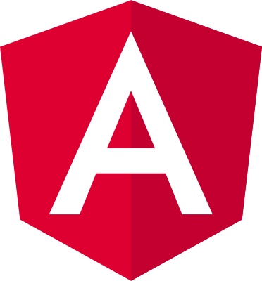
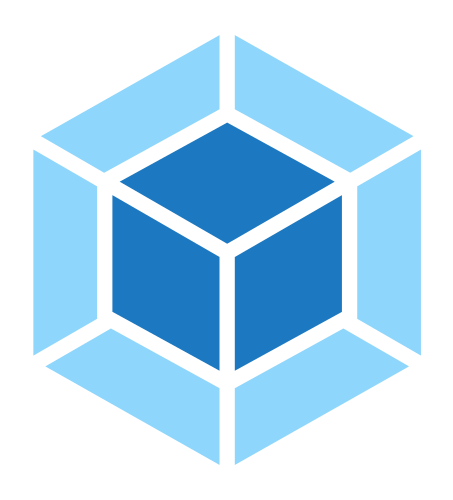

<p align="center">
    
    <br/>
    <h1 align="center">Analytics Portal</h1>
    <p align="center" style="font-size: 1.2rem;">The Analytics Portal codebase for SAFE PLANT</p>
</p>
<br/>

# Quick start

> The generated project have dependencies that require `node` together with `npm`.

**Make sure you have Node version >= 8.0 and (NPM >= 5 or [Yarn](https://yarnpkg.com) )**

```bash
# clone the repository
git clone https://github.com/brionmario/analytics-portal.git

# change the directory
cd analytics-portal

# install the dependencies with npm
npm install

# start the development server
npm start

```

# Built With

<a href="https://angular.io/" title="Angular"></a>&nbsp;&nbsp;
<a href="https://webpack.js.org/" title="Webpack"></a>&nbsp;&nbsp;
<a href="http://reactivex.io/" title="Rxjs"></a>&nbsp;&nbsp;
<a href="https://www.npmjs.com/" title="npm"></a>&nbsp;&nbsp;
<a href="https://sass-lang.com/" title="Sass"></a>&nbsp;&nbsp;
<a href="https://getbootstrap.com/docs/4.0/getting-started/introduction/" title="Bootstrap"></a>&nbsp;&nbsp;
<a href="https://jquery.com/" title="Jquery"></a>&nbsp;&nbsp;

# License

This project is licensed under the MIT License - see the [LICENSE.md](LICENSE.md) file for details.
